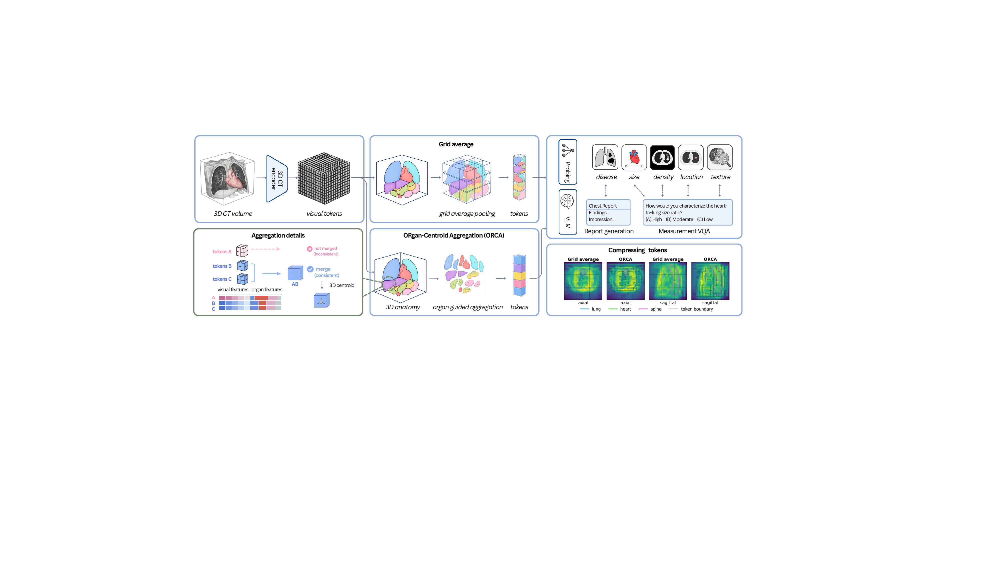

# ORCA: ORgan-Centroid Aggregation for Training-Free 3D CT Visual Token Compression

[📄 arXiv](https://arxiv.org/abs/2608.00345) · [💻 GitHub](https://github.com/renjie-liang/ORCA-3DCT) · [🤗 Models & Data](https://huggingface.co/datasets/LiangRenjie/ORCA-3DCT)



A 3D CT scan produces thousands to tens of thousands of visual tokens, and they must be compressed before a language model can consume them. **ORCA** is a training-free compressor: it merges neighbouring tokens into connected, organ-guided regions and writes each region's centroid position back into the token, preserving the anatomical evidence that grid pooling blends away. It is plug-and-play, giving an adjustable token budget with no model change, attention hook, extra supervision, or text query.

---

## Released embeddings

We provide both compressed and uncompressed embeddings at **[ORCA-3DCT](https://huggingface.co/datasets/LiangRenjie/ORCA-3DCT)**. Each encoder's outputs were obtained either by running its authors' released checkpoint or by reproducing the encoder from its paper.
We also release the organ segmentation resampled from TotalSegmentator onto each encoder's token grid. Use the matched set: encoders resample and crop the volume differently, so a segmentation built for one grid does not align with another.

### CT-RATE

| <sub>Encoder</sub> | <sub>ORCA `B=216`</sub> | <sub>ORCA `B=64`</sub> | <sub>ORCA `B=27`</sub> | <sub>Grid avg `B=216`</sub> | <sub>Grid avg `B=64`</sub> | <sub>Grid avg `B=27`</sub> | <sub>Uncompressed</sub> | <sub>Organ segmentation</sub> |
|---|---|---|---|---|---|---|---|---|
| <sub>[COLIPRI](https://arxiv.org/abs/2510.15042)</sub> | <sub>[216×792<br>8.79 GB](https://huggingface.co/datasets/LiangRenjie/ORCA-3DCT/tree/main/compressed/colipri/colipri_ORCA_b216_d792_lam0p5)</sub> | <sub>[64×792<br>2.60 GB](https://huggingface.co/datasets/LiangRenjie/ORCA-3DCT/tree/main/compressed/colipri/colipri_ORCA_b64_d792_lam0p5)</sub> | <sub>[27×792<br>1.10 GB](https://huggingface.co/datasets/LiangRenjie/ORCA-3DCT/tree/main/compressed/colipri/colipri_ORCA_b27_d792_lam0p5)</sub> | <sub>[216×768<br>8.53 GB](https://huggingface.co/datasets/LiangRenjie/ORCA-3DCT/tree/main/compressed/colipri/colipri_GridAvg_b216_d768)</sub> | <sub>[64×768<br>2.53 GB](https://huggingface.co/datasets/LiangRenjie/ORCA-3DCT/tree/main/compressed/colipri/colipri_GridAvg_b64_d768)</sub> | <sub>[27×768<br>1.07 GB](https://huggingface.co/datasets/LiangRenjie/ORCA-3DCT/tree/main/compressed/colipri/colipri_GridAvg_b27_d768)</sub> | <sub>[24×24×24×768<br>545 GB](https://huggingface.co/datasets/LiangRenjie/ORCA-3DCT/tree/main/uncompressed/colipri)</sub> | <sub>[11×24×24×24<br>0.37 GB](https://huggingface.co/datasets/LiangRenjie/ORCA-3DCT/tree/main/organ_masks/colipri)</sub> |
| <sub>[CT-CLIP](https://doi.org/10.1038/s41551-025-01599-y)</sub> | <sub>[216×536<br>13.0 GB](https://huggingface.co/datasets/LiangRenjie/ORCA-3DCT/tree/main/compressed/ct_clip/ct_clip_ORCA_b216_d536_lam0p5)</sub> | <sub>[64×536<br>3.44 GB](https://huggingface.co/datasets/LiangRenjie/ORCA-3DCT/tree/main/compressed/ct_clip/ct_clip_ORCA_b64_d536_lam0p5)</sub> | <sub>[27×536<br>1.45 GB](https://huggingface.co/datasets/LiangRenjie/ORCA-3DCT/tree/main/compressed/ct_clip/ct_clip_ORCA_b27_d536_lam0p5)</sub> | <sub>[216×512<br>12.4 GB](https://huggingface.co/datasets/LiangRenjie/ORCA-3DCT/tree/main/compressed/ct_clip/ct_clip_GridAvg_b216_d512)</sub> | <sub>[64×512<br>3.29 GB](https://huggingface.co/datasets/LiangRenjie/ORCA-3DCT/tree/main/compressed/ct_clip/ct_clip_GridAvg_b64_d512)</sub> | <sub>[27×512<br>1.39 GB](https://huggingface.co/datasets/LiangRenjie/ORCA-3DCT/tree/main/compressed/ct_clip/ct_clip_GridAvg_b27_d512)</sub> | <sub>[24×24×24×512<br>710 GB](https://huggingface.co/datasets/LiangRenjie/ORCA-3DCT/tree/main/uncompressed/ct_clip)</sub> | <sub>[11×24×24×24<br>0.93 GB](https://huggingface.co/datasets/LiangRenjie/ORCA-3DCT/tree/main/organ_masks/ctclip)</sub> |
| <sub>[ViSD-Boost + CT-CLIP](https://arxiv.org/abs/2508.03742)</sub> | — | — | — | — | — | — | <sub>[5×256<br>0.13 GB](https://huggingface.co/datasets/LiangRenjie/ORCA-3DCT/tree/main/uncompressed/visd_boost_ctclip/visd_boost_ctclip_native_b5_d256)</sub> | — |
| <sub>[ViSD-Boost](https://arxiv.org/abs/2508.03742)</sub> | — | — | — | — | — | — | <sub>[4×256<br>0.10 GB](https://huggingface.co/datasets/LiangRenjie/ORCA-3DCT/tree/main/uncompressed/visd_boost/visd_boost_native_b4_d256)</sub> | — |
| <sub>[FVLM](https://arxiv.org/abs/2501.14548)</sub> | — | — | — | — | — | — | <sub>[4×256<br>0.10 GB](https://huggingface.co/datasets/LiangRenjie/ORCA-3DCT/tree/main/uncompressed/fvlm/fvlm_native_b4_d256)</sub> | — |

**Coverage.** CT-CLIP covers all of CT-RATE (47,149 train / 3,039 valid). COLIPRI covers 24,128 / 1,564, because its authors take one reconstruction per scan to be sufficient; CT-RATE ships several reconstructions of the same study.

### Loading

```python
import numpy as np
from huggingface_hub import snapshot_download

d = snapshot_download("LiangRenjie/ORCA-3DCT", repo_type="dataset",
                      allow_patterns="compressed/colipri/colipri_ORCA_b216_d792_lam0p5/*")
tokens = np.load(f"{d}/compressed/colipri/colipri_ORCA_b216_d792_lam0p5/valid.npy", mmap_mode="r")  # (1564, 216, 792) fp16
ids    = open(f"{d}/compressed/colipri/colipri_ORCA_b216_d792_lam0p5/valid_ids.txt").read().split()
tokens[ids.index("valid_1000_a_2")]        # -> (216, 792), ready for a projector
```

Organ masks are `.npz`, one member per volume, so a single volume decompresses on its own:

```python
z = np.load(f"{d}/organ_masks/colipri/valid.npz")
z["valid_1000_a_2"]        # -> (11, 24, 24, 24) fp16, soft occupancy in [0, 1]
z["_channel_names"]        # -> lung, airway, heart, aorta, ...
```

---

## Main results

CT-RATE with the COLIPRI encoder at a budget of 216 tokens. The first five columns are probing read-outs — AUROC for disease, $R^2$ for the rest — and the last three are report-generation metrics.

|  | <sub>disease</sub> | <sub>size</sub> | <sub>density</sub> | <sub>location</sub> | <sub>texture</sub> | <sub>CE-F1</sub> | <sub>CRG</sub> | <sub>GREEN</sub> |
|---|---|---|---|---|---|---|---|---|
| <sub>Uncompressed</sub> | <sub>0.848</sub> | <sub>0.727</sub> | <sub>0.915</sub> | <sub>0.252</sub> | <sub>0.811</sub> | — | — | — |
| <sub>Uncompressed + centroid</sub> | <sub>0.849</sub> | <sub>0.791</sub> | <sub>0.930</sub> | <sub>0.773</sub> | <sub>0.829</sub> | — | — | — |
| <sub>Grid average</sub> | <sub>0.851</sub> | <sub>0.681</sub> | <sub>0.865</sub> | <sub>0.247</sub> | <sub>0.760</sub> | <sub>**0.475**</sub> | <sub>**0.438**</sub> | <sub>0.319</sub> |
| <sub>**ORCA**</sub> | <sub>**0.852**</sub> | <sub>**0.720**</sub> | <sub>**0.913**</sub> | <sub>**0.677**</sub> | <sub>**0.816**</sub> | <sub>0.470</sub> | <sub>0.436</sub> | <sub>**0.329**</sub> |

ORCA wins every probing attribute and leads on GREEN; the report-generation text metrics are near-saturated across compressors. It also shrinks the LLM visual context $64\times$. Full results are under `results/` and `results_llm/`.

---

## Quickstart

```bash
git clone https://github.com/renjie-liang/ORCA-3DCT.git && cd ORCA-3DCT

conda env create -f environment.yml && conda activate orca3dct   # python 3.12

python download.py --bundle reportgen --budget 216   # 8.8 GB of ORCA tokens

# both are gated — accept the terms on the Hub first
#   https://huggingface.co/datasets/ibrahimhamamci/CT-RATE
#   https://huggingface.co/meta-llama/Llama-3.1-8B-Instruct
python download.py --annotations                    # CT-RATE reports and labels
python download.py --base-weights                   # Llama-3.1-8B

bash llm_engine/run_reportgen.sh --smoke                    # ~15 min wiring check
bash llm_engine/run_reportgen.sh --method ORCA --budget 216 # the real cell (~36 h on one B200)
```

See **[TRAINING.md](TRAINING.md)** for the full pipeline and the traps worth knowing. [CheapCT](https://github.com/renjie-liang/CheapCT) provides vLLM inference and GREEN. We recommend using it for inference and scoring.

### Environment

Only three pins matter and everything else can be whatever your CUDA stack prefers.

| pinned | why |
|---|---|
| `python=3.12` | the engine uses 3.10+ syntax |
| `transformers>=4.50` | `LlamaAttention.forward` changed shape across 4.x. We ran 4.57.1 |
| `deepspeed>=0.14` | the ZeRO-1 config uses post-0.14 keys |

---

## License

Code: Apache-2.0. `llm_engine/llava/` is from LLaVA. Embeddings: CC-BY-NC-SA-4.0, inherited from CT-RATE, research use only.

```bibtex
@article{orca2026,
  title   = {ORCA: ORgan-Centroid Aggregation for Training-Free 3D CT Visual Token Compression},
  journal = {arXiv preprint arXiv:2608.00345},
  year    = {2026}
}
```

## Acknowledgements

[CheapCT](https://github.com/renjie-liang/CheapCT) · [AdaRAG-CT](https://github.com/renjie-liang/Adaptive-RAG-for-3DCT-Report-Generation) · [CT-RATE / CT-CLIP](https://github.com/ibrahimethemhamamci/CT-CLIP) · [COLIPRI](https://huggingface.co/microsoft/colipri) · [FVLM](https://github.com/alibaba-damo-academy/FVLM) · [ViSD-Boost](https://github.com/alibaba-damo-academy/ViSD-Boost) · [TotalSegmentator](https://github.com/wasserth/TotalSegmentator) · [LLaVA](https://github.com/haotian-liu/LLaVA)
